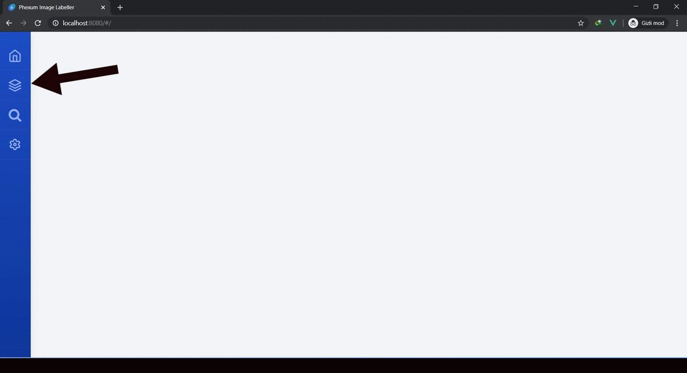

# label-img

Bilgisayarınızda bulunan görsellere etiketler ekleyebildiğiniz, etiketleri aratarak onlarla ilişkili görselleri görüntüleyebildiğiniz ve görsellerinizin bu etiketler kullanılarak otomatik olarak kategorize edildiği bir projedir.

## label-img v1.0 Özellikleri
- Resize işlemleri farklı thread'lerde gerçekleştirilerek performans artışı sağlandı.
- HikariCP ile connection pooling uygulandı.
- Front-end ve back-end iletişimi ajax ve web socket ile sağlandı.
- Tüm görseller veri tabanında unique olarak saklandı.
- Anasayfada sadece settings sayfasında **active** olarak belirtilen dizindeki görseller gösterildi

##

